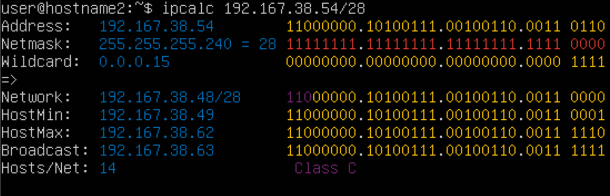
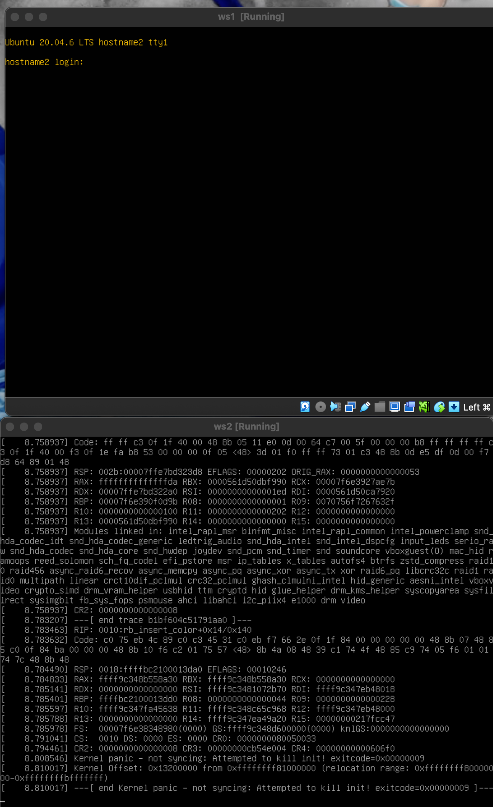
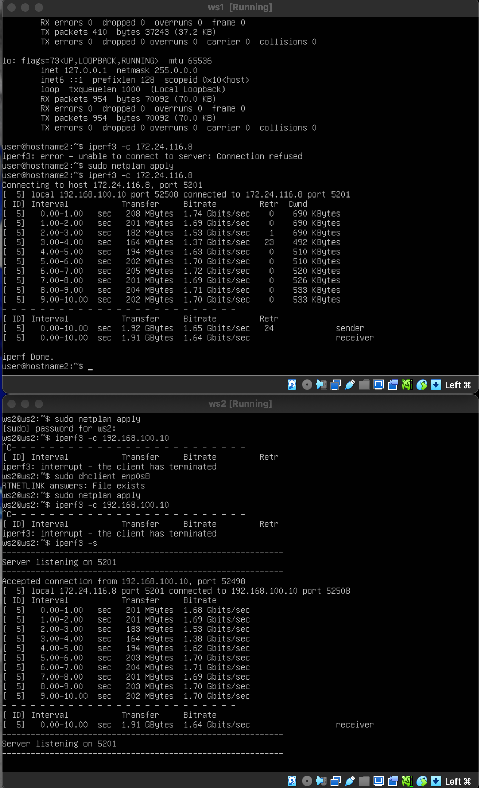
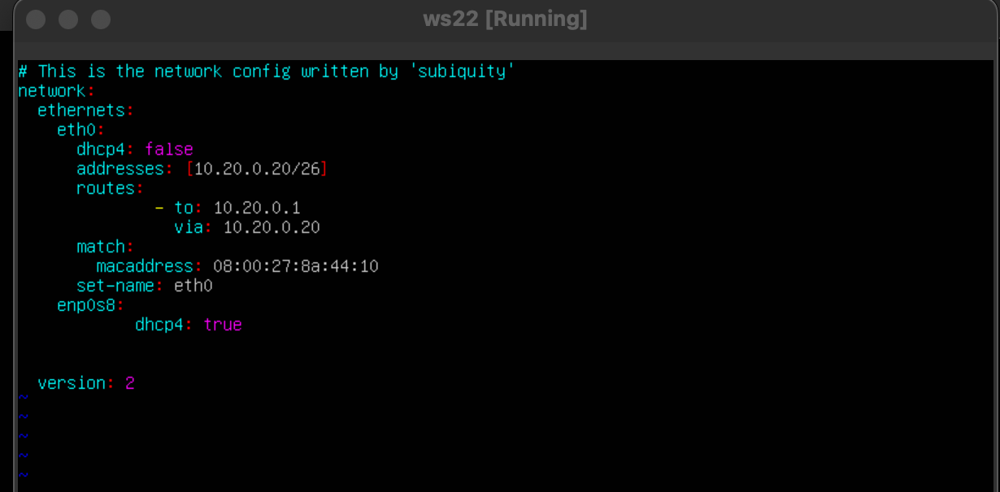
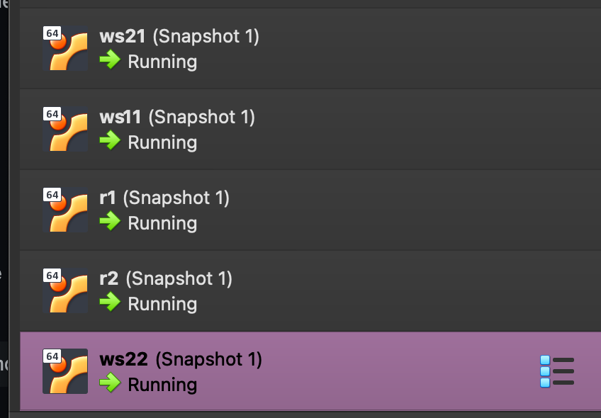

## Part 1. Инструмент **ipcalc**

**Поднимаем виртуальную машину ws1**

**Установка инструмента **ipcalc****

**Адрес сети 192.167.38.54/13**

**Перевод маски 255.255.255.0 в префиксную и двоичную запись, /15 в обычную и двоичную, 11111111.11111111.11111111.11110000 в обычную и префиксную**

Перевод маски в префиксной и двоичной записи можно увидеть в графе **NetMask**

255:

15:

11111111.11111111.11111111.11110000:

**Минимальный и максимальный хост в сети *12.167.38.4**

Увидеть  минимальный и максимальный хост в сети можно в строчке **HostMin** и **HostMax** соответственно.

/8:

11111111.11111111.00000000.00000000:

255.255.254.0:

/4:

1.2 localhost

Определить и записать в отчёт, можно ли обратиться к приложению, работающему на localhost, со следующими IP: 194.34.23.100, 127.0.0.2, 127.1.0.1, 128.0.0.1

**можно:**
- 127.0.0.2,
- 127.1.0.1

**нельзя:**
- 194.34.23.100,
- 128.0.0.1
Так как localhost находится в диапазоне 127.0.0.1 — 127.255.255.254

1.3 Диапазоны и сегменты сетей
частные входят в следующие диапазоны:

10.0.0.0 — 10.255.255.255

100.64.0.0 — 100.127.255.255

172.16.0.0 — 172.31.255.255

192.168.0.0 — 192.168.255.255

остальные являются публиными.

10.0.0.45 - частный

134.43.0.2- публичный

192.168.4.2 - частный

172.20.250.4 - частный

172.0.2.1 - публичный

192.172.0.1 - публичный

172.68.0.2 - публичный

172.16.255.255 - частный

10.10.10.10 - частный

192.169.168.1 - публичный

2) Какие из перечисленных IP адресов шлюза возможны у сети 10.10.0.0/18:

Должно находиться в диапазоне 10.10.0.1-10.10.63.254

- 10.0.0.1- не подходит

**10.10.0.2 - подходит**

**10.10.10.10 - подходит**

- 10.10.100.1 - не подходит

**10.10.1.255-подходит**

## Part 2. Статическая маршрутизация между двумя машинами

**Поднимаем две виртуальные машины ws1 и ws2**

**Смотрим все существующие сетевые интерфейсы на двух машинах ws1 и ws2**

**Опиши сетевой интерфейс, соответствующий внутренней сети, на обеих машинах и задать следующие адреса и маски: ws1 - 192.168.100.10, маска /16, ws2 - 172.24.116.8, маска /12.**

Меняем конфиг **netplan** на двух машинах, так чтобы совпадало по заданиям:

Выполняем команду **netplan apply** для перезапуска сервиса сети на двух машинах.

Выполняем снова **ip a** для проверки измений.

# 2.1 Добавление статического маршрута вручную

Добавляем статический маршрут к одной машине ws1 к другой ws2, используя команду **ip r add**

К ip r add мы добавляем  их адреса машин и название сети для того чтобы связать статически их между собой.

Пингуем наши машины ws1 и ws2 между собой:

# 2.2 Добавление статического маршрута с сохранением
Перезапуск машины:

Добавляем в *etc/netplan/00-installer-config.yaml*. статический маршрут от одной машины к другой:

Пингуем машины между собой:

## Part 3 Утилита **iperf**
3.1. Скорость соединения
Перевести и записать в отчёт:

8 Mbps = 1 MB/s

100 MB/s = 819200 Kbps

1 Gbps = 1024 Mbps

# 3.2. Утилита iperf3
Измеряем скорость двух между двумя машинами (ws1 и ws2)

## Part 4 Cетевой экран

Создаем файл **firewall.sh** в папке **/etc/** имитирующий фаерволл

Выдам права на **firewall.sh** используя команду **сhmod +x**

##### Нужно добавить в файл подряд следующие правила:
##### 1) На ws1 примени стратегию, когда в начале пишется запрещающее правило, а в конце пишется разрешающее правило (это касается пунктов 4 и 5).
##### 2) На ws2 примени стратегию, когда в начале пишется разрешающее правило, а в конце пишется запрещающее правило (это касается пунктов 4 и 5).
##### 3) Открой на машинах доступ для порта 22 (ssh) и порта 80 (http).
##### 4) Запрети *echo reply* (машина не должна «пинговаться», т.е. должна быть блокировка на OUTPUT).
##### 5) Разреши *echo reply* (машина должна «пинговаться»).

Запускаем файрволлы на двух машинах:

В первой машине ws1 будет пинг запрещен (разрешение после запрета)
Во второй машине ws2 разрешение стоит первее чем его запрет

#### 4.2. Утилита **nmap**
##### Командой **ping** найди машину, которая не «пингуется», после чего утилитой **nmap** покажи, что хост машины запущен.

*Проверка: в выводе nmap должно быть сказано: `Host is up`*.

nmap: 

Cохраняем дампы образов машин:
ws1:

ws2:

Настрой конфигурации машин в etc/netplan/00-installer-config.yaml согласно сети на рисунке.
<!--  -->

<!-- ws22 mac address:
enp0s3: 08:00:27:8a:44:10
enp0s8: 08:00:27: -->
<!-- ws21 mac address:
enp0s3: 08:00:27:3d:61:52 -->

<!-- ws11 mac address:
enp0s3: 08:00:27:5e:30:a2 -->

<!-- r2 mac address:
enp0s3: 08:00:27:78:dc:f7
enp0s8: 08:00:27:97:37:e4 -->

<!-- r1 mac address:
enp0s3: 08:00:27:a4:c4:f9
enp0s8: 08:00:27:e1:79:80 -->

Командой ip -4 a проверить, что адрес машины задан верно.

Также пропингуй ws22 с ws21. Аналогично пропингуй r1 с ws11.

# 5.2. Включение переадресации IP-адресов.

Откройте файл /etc/sysctl.conf и добавьте в него следующую строку: net.ipv4.ip_forward = 1

#### 5.3. Установка маршрута по-умолчанию

Добавляем default перед IP роутера в файле конфигураций

Вывод команды `ip r` после добавления шлюза:

Пропинговать с ws11 роутер r2 и показать на r2, что пинг доходит. Для этого использовать команду: tcpdump -tn -i eth1

#### 5.4. Добавление статических маршрутов
##### Добавь в роутеры r1 и r2 статические маршруты в файле конфигураций. Пример для r1 маршрута в сетку 10.20.0.0/26:

ip r:

<!-- r1:
enp0s9: 08:00:27:fe:aa:c0

r2:
enp0s9: 08:00:27:9a:0f:45 -->

##### Запусти команды на ws11:
`ip r list 10.10.0.0/[маска сети]` и `ip r list 0.0.0.0/0`

Первый был, так как он уже прописан в нетплане и выбирается тот вариант, где маска длиннее.

#### 5.5. Построение списка маршрутизаторов

##### Запусти на r1 команду дампа:
`tcpdump -tnv -i eth0`

##### При помощи утилиты **traceroute** построй список маршрутизаторов на пути от ws11 до ws21.

Пример вывода утилиты **traceroute** после добавления шлюза:

1 | 10.10.0.1 0 ms 1 ms 0 ms
2 | 10.100.0.12 1 ms 0 ms 1 ms
3 | 10.20.0.10 12 ms 1 ms 3 ms

traceroute позволяет пользователям видеть каждый hop на пути к целевому IP-адресу и измерять время отклика для каждого hop.

#### 5.6. Использование протокола **ICMP** при маршрутизации
##### Запусти на r1 перехват сетевого трафика, проходящего через eth0 с помощью команды:
`tcpdump -n -i eth0 icmp`

##### Пропингуй с ws11 несуществующий IP (например, *10.30.0.111*) с помощью команды:
`ping -c 1 10.30.0.111`

##### Сохрани дампы образов виртуальных машин.

## Part 6. Динамическая настройка IP с помощью **DHCP**

##### Для r2 настрой в файле */etc/dhcp/dhcpd.conf* конфигурацию службы **DHCP**:

##### 2) В файле *resolv.conf* пропиши `nameserver 8.8.8.8`.

#### Перезагрузи службу **DHCP** командой `systemctl restart isc-dhcp-server`. Машину ws21 перезагрузи при помощи `reboot` и через `ip a` покажи, что она получила адрес. Также пропингуй ws22 с ws21.

через `ip a` покажи, что она получила адрес.

Также пропингуй ws22 с ws21.

##### Укажи MAC адрес у ws11, для этого в *etc/netplan/00-installer-config.yaml* надо добавить строки: `macaddress: 10:10:10:10:10:BA`, `dhcp4: true`.
Обновление конфига

ip a до:

ip a после:

##### Для r1 настрой аналогично r2, но сделай выдачу адресов с жесткой привязкой к MAC-адресу (ws11). Проведи аналогичные тесты.

##### Запроси с ws21 обновление ip адреса.

- В отчёте опиши, какими опциями **DHCP** сервера пользовался в данном пункте.

**sudo dhclient -v** добавить ip
**sudo dhclient -r** удалить ip

##### Сохрани дампы образов виртуальных машин.

## Part 7. **NAT**

##### В файле */etc/apache2/ports.conf* на ws22 и r1 измени строку `Listen 80` на `Listen 0.0.0.0:80`, то есть сделай сервер Apache2 общедоступным.

##### Запусти веб-сервер Apache командой `service apache2 start` на ws22 и r1.

#### Добавь в фаервол, созданный по аналогии с фаерволом из Части 4, на r2 следующие правила:
##### 1) Удаление правил в таблице filter - `iptables -F`;
##### 2) Удаление правил в таблице "NAT" - `iptables -F -t nat`;
##### 3) Отбрасывать все маршрутизируемые пакеты - `iptables --policy FORWARD DROP`.
##### Запусти файл также, как в Части 4.

##### Проверь соединение между ws22 и r1 командой `ping`.

*При запуске файла с этими правилами, ws22 не должна «пинговаться» с r1.*

##### Добавь в файл ещё одно правило:
##### 4) Разрешить маршрутизацию всех пакетов протокола **ICMP**.

##### Проверь соединение между ws22 и r1 командой `ping`.

*При запуске файла с этими правилами, ws22 должна «пинговаться» с r1.*

##### Добавь в файл ещё два правила:
##### 5) Включи **SNAT**, а именно маскирование всех локальных ip из локальной сети, находящейся за r2 (по обозначениям из Части 5 - сеть 10.20.0.0).

##### 6) Включи **DNAT** на 8080 порт машины r2 и добавить к веб-серверу Apache, запущенному на ws22, доступ извне сети.

##### Проверь соединение по TCP для **SNAT**: для этого с ws22 подключиться к серверу Apache на r1 командой:

#### Проверь соединение по TCP для **DNAT**: для этого с r1 подключиться к серверу Apache на ws22 командой `telnet` (обращаться по адресу r2 и порту 8080).

##### Сохрани дампы образов виртуальных машин.

## Part 8. Дополнительно. Знакомство с **SSH Tunnels**

##### Запусти на r2 фаервол с правилами из Части 7.

##### Запусти веб-сервер **Apache** на ws22 только на localhost (то есть в файле */etc/apache2/ports.conf* измени строку `Listen 80` на `Listen localhost:80`).

##### Воспользуйся *Local TCP forwarding* с ws21 до ws22, чтобы получить доступ к веб-серверу на ws22 с ws21.

ssh -L

##### Воспользуйся *Remote TCP forwarding* c ws11 до ws22, чтобы получить доступ к веб-серверу на ws22 с ws11.

ssh -R 

<!-- - В отчёте опиши команды, необходимые для выполнения этих четырёх пунктов, а также приложи скриншоты с их вызовом и выводом. -->

##### Сохрани дампы образов виртуальных машин.
